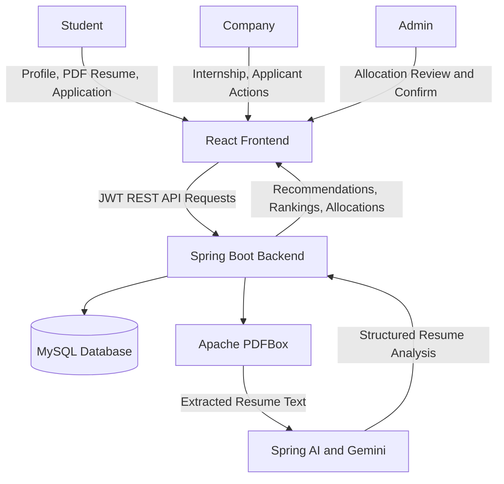
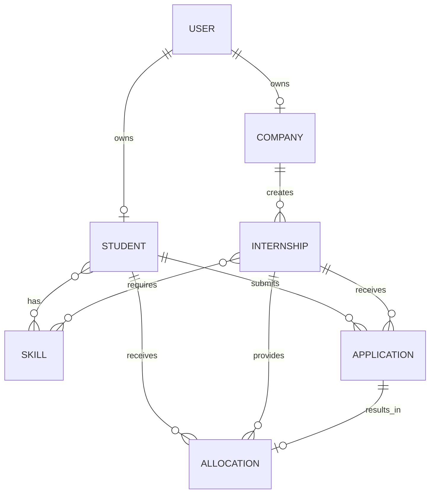
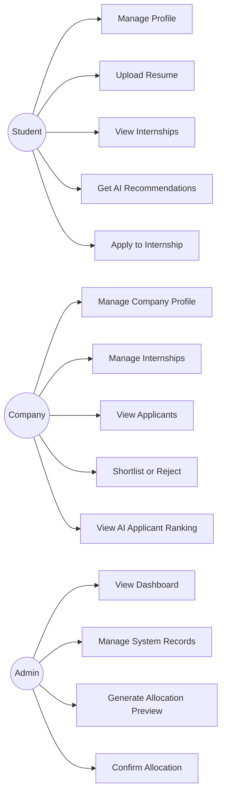
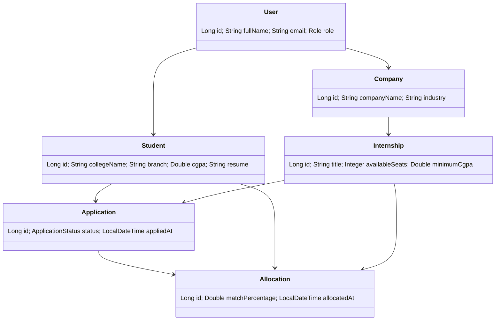
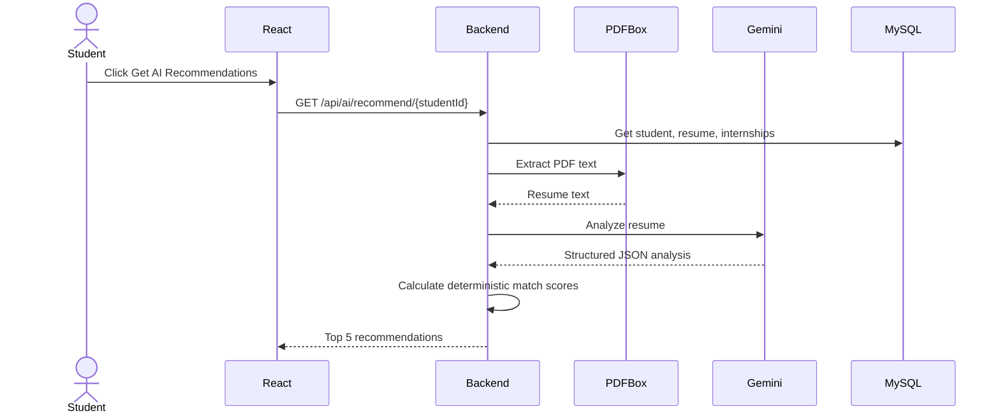
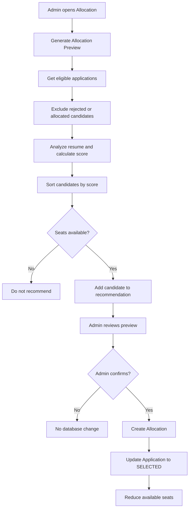
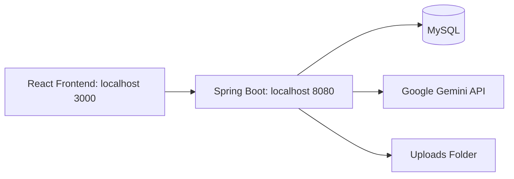
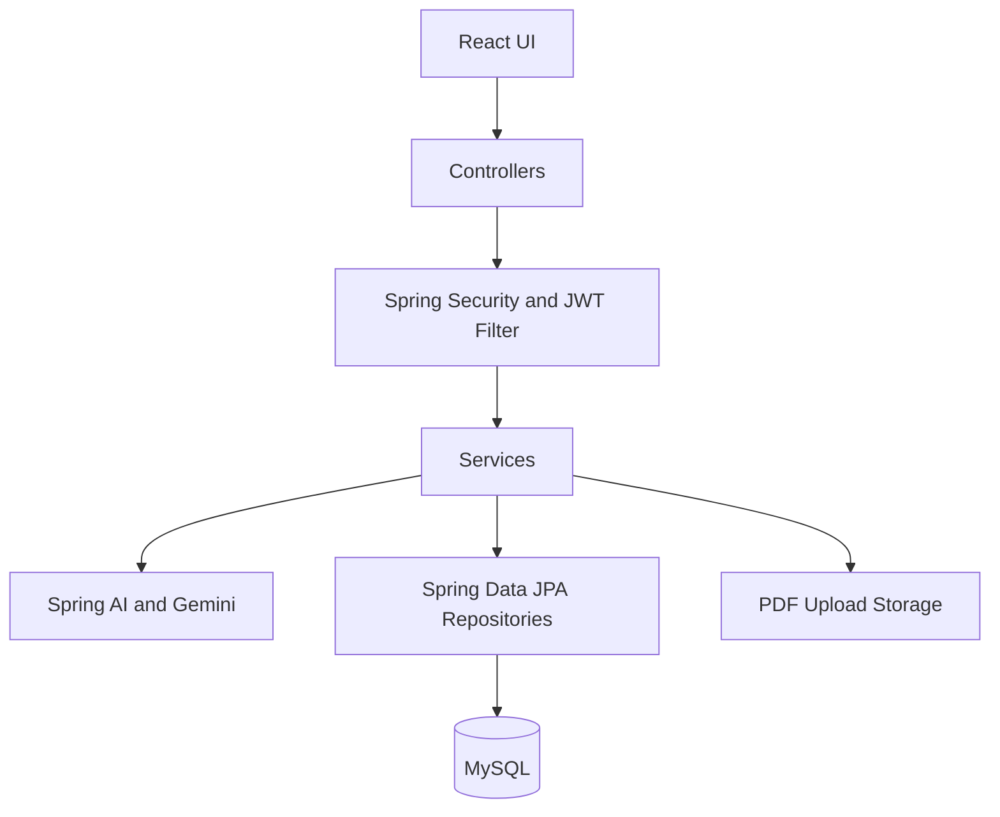

# AI-Based Internship Allocation System

## Index

| Sr. No. | Title | Page No. |
|---:|---|---:|
| 1 | Introduction | 2 |
| 2 | Problem Definition & Scope | 3 |
| 2.1 | Problem Definition | 3 |
| 2.2 | Goals & Objectives | 4 |
| 2.3 | Major Constraints & Outcomes | 4 |
| 3 | Software Requirement Specification | 5 |
| 3.1 | Proposed System | 5 |
| 3.2 | Functional Requirements | 6 |
| 4 | Scope | 7 |
| 5 | System Modules | 8 |
| 5.1 | Performance, Hardware & Software Requirements | 9 |
| 6 | UML / System Diagrams | 10 |
| 6.1 | DFD | 10 |
| 6.2 | ERD | 11 |
| 6.3 | Use Case Diagram | 12 |
| 6.4 | Class Diagram | 13 |
| 6.5 | Sequence Diagram | 14 |
| 6.6 | Activity Diagram | 15 |
| 6.7 | Deployment Diagram | 16 |
| 6.8 | System Architecture | 17 |
| 7 | Test Cases & Verification | 18 |
| 8 | Screenshots | 21 |
| 9 | References | 22 |

> Update page numbers after exporting this document to Word or PDF.

## 1. Introduction

The AI-Based Internship Allocation System is a web application that connects students, companies, and administrators for internship management and allocation.

Students create profiles, upload PDF resumes, receive AI-assisted internship recommendations, apply for internships, and track application/allocation status. Companies publish internships, review applicants, shortlist or reject candidates, and view AI-assisted applicant rankings. Administrators review allocation recommendations and confirm final allocations while respecting available seats.

## 2. Problem Definition & Scope

### 2.1 Problem Definition

Traditional internship allocation is often manual, slow, and difficult to manage when many students apply for limited positions. Comparing candidate skills, academic scores, resumes, preferred locations, and internship requirements consistently is challenging.

The system solves this problem by using resume analysis and deterministic scoring to recommend suitable internships and rank applicants.

### 2.2 Goals & Objectives

- Provide role-based access for Student, Company, and Admin.
- Allow students to upload PDF resumes and maintain profiles.
- Analyze resume text using Google Gemini through Spring AI.
- Generate top internship recommendations.
- Prevent duplicate internship applications.
- Allow companies to rank applicants using match scores.
- Provide admin-controlled allocation preview and confirmation.
- Respect internship seat limits.
- Keep AI as decision support; final allocation requires admin confirmation.

### 2.3 Major Constraints & Outcomes

Constraints:

- Gemini API availability, quota, and valid API key are required.
- Only text-based PDF resumes can be reliably analyzed.
- MySQL database must be running.
- AI output is validated before use.
- The system does not send passwords or JWT tokens to Gemini.

Outcomes:

- Faster internship screening.
- Explainable matching based on skills, CGPA, location, and project/experience relevance.
- Controlled and auditable allocation flow.

## 3. Software Requirement Specification

### 3.1 Proposed System

The proposed system uses React for the frontend and Spring Boot for backend REST APIs. JWT is used for authentication. MySQL stores users, profiles, internships, applications, skills, and allocations.

Google Gemini analyzes resume text extracted with Apache PDFBox. The final internship score remains deterministic in Java.

### 3.2 Functional Requirements

| Module | Main Functions |
|---|---|
| Authentication | Register, login, JWT validation, password change, logout |
| Student | Profile, skills, resume upload, internships, recommendations, applications |
| Company | Profile, internship CRUD, applicant list, shortlist/reject, AI ranking |
| Admin | Dashboard, users, internships, allocation preview, allocation confirmation |
| AI | Gemini resume analysis, deterministic matching, applicant ranking |
| Resume | PDF validation, secure upload, restricted viewing |
| Allocation | Application-only candidate selection, seat-limit enforcement |

## 4. Scope

Included:

- Student, company, and admin roles.
- Internship posting and application workflow.
- AI-based resume extraction and recommendations.
- Company AI applicant ranking.
- Admin allocation preview and confirmation.
- Secure JWT-based API access.

Not included:

- Payment or order modules; these are not applicable to an internship allocation system.
- External job-board integrations.
- Cloud object storage.
- Automated final allocation without admin confirmation.

## 5. System Modules

1. Authentication Module
2. Student Profile Module
3. Company Profile Module
4. Internship Management Module
5. Resume Upload and Processing Module
6. AI Recommendation Module
7. Application Management Module
8. Company Applicant Ranking Module
9. Admin Allocation Module
10. Dashboard and Reporting Module

### 5.1 Performance, Hardware & Software Requirements

Software:

- Java 17
- Spring Boot
- MySQL 8+
- ReactJS
- Node.js and npm
- Maven
- Google Gemini API key
- Modern browser

Hardware:

- Minimum 4 GB RAM
- Dual-core processor
- 2 GB free storage
- Internet connection for Gemini API

Performance expectations:

- Normal REST responses should complete quickly.
- AI analysis depends on Gemini response time.
- Resume analysis is cached during backend runtime to reduce repeated Gemini calls.
- Allocation respects available seats and does not allocate one student multiple times.

## 6. UML / System Diagrams

### 6.1 Data Flow Diagram

### 6.2 ER Diagram

### 6.3 Use Case Diagram

### 6.4 Class Diagram

### 6.5 Sequence Diagram: AI Recommendation

### 6.6 Activity Diagram: Allocation

### 6.7 Deployment Diagram

### 6.8 System Architecture

## 7. Test Cases and Verification Steps

| Test ID | Test Case | Steps | Expected Result |
|---|---|---|---|
| TC-01 | Student registration | Register with Student role | Student user/profile created |
| TC-02 | Company registration | Register with Company role | Company user/profile created |
| TC-03 | Login | Login with valid credentials | JWT token returned and dashboard opens |
| TC-04 | Unauthorized access | Access another student's profile URL | 403 Forbidden |
| TC-05 | Resume validation | Upload JPG, empty PDF, or file over 10 MB | Upload rejected |
| TC-06 | Resume upload | Upload valid text PDF | PDF stored and filename saved |
| TC-07 | AI recommendation | Click Get AI Recommendations | Top ranked internships displayed |
| TC-08 | Duplicate application | Apply twice to same internship | 409 Conflict / Already Applied |
| TC-09 | Company ownership | Edit another company's internship | 403 Forbidden |
| TC-10 | Applicant ranking | Company opens applicant ranking | Ranked candidate list shown |
| TC-11 | Allocation preview | Admin generates preview | Eligible candidates shown by internship |
| TC-12 | Seat limit | Internship has 2 seats and 4 candidates | Maximum 2 allocations |
| TC-13 | Confirm allocation | Admin confirms preview | Allocation saved and application SELECTED |
| TC-14 | Gemini failure | Remove key or exhaust quota | Readable error and no invalid allocation |

### Manual Verification Workflow

1. Start MySQL and use the `pm_internship_db` database.
2. Configure `GEMINI_API_KEY` for the backend process.
3. Start the Spring Boot backend.
4. Start the React frontend.
5. Register a company and complete its profile.
6. Create an internship with Java, Spring Boot, MySQL, React, and two seats.
7. Register a student and complete the profile.
8. Upload a text-based PDF resume.
9. Open AI Recommendations and verify ranked recommendations.
10. Apply for an internship.
11. Log in as company, open applications, and generate applicant ranking.
12. Shortlist or reject applicants as required.
13. Log in as admin and generate allocation preview.
14. Verify recommended students, scores, and seat limits.
15. Confirm allocation.
16. Verify application status changes to `SELECTED` and seats are reduced.

## 8. Screenshot Checklist

Payment and order screenshots are not applicable to this internship allocation system.

1. Landing page
2. Registration page
3. Login page
4. Student dashboard
5. Student profile
6. Student resume upload
7. Internship listing
8. AI recommendation cards
9. Apply Now / Already Applied state
10. Student applications page
11. Company dashboard
12. Create internship page
13. Company internship list
14. Applications received page
15. AI applicant ranking table
16. Admin dashboard
17. Allocation preview page
18. Confirmed allocations page

## 9. References

1. [Spring Boot Documentation](https://spring.io/projects/spring-boot)
2. [Spring Security Documentation](https://spring.io/projects/spring-security)
3. [Spring AI Documentation](https://docs.spring.io/spring-ai/reference/)
4. [Google Gemini API Documentation](https://ai.google.dev/gemini-api/docs)
5. [React Documentation](https://react.dev)
6. [React Router Documentation](https://reactrouter.com)
7. [MySQL Documentation](https://dev.mysql.com/doc/)
8. [Apache PDFBox Documentation](https://pdfbox.apache.org/)
9. [JWT Documentation](https://jwt.io/)
